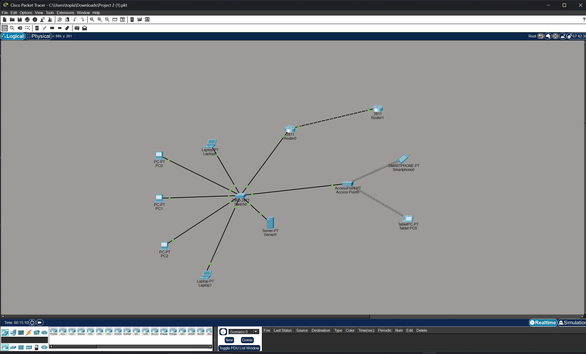

# Hybrid-WLAN-Static-Routing
# Network Infrastructure Project

## Topology Overview
This design features a Star Topology with a central Switch, a Server, and Wireless Access Point.
# Network Infrastructure Project

## Topology Overview
This design features a Star Topology with a central Switch, a Server, and Wireless Access Point.

## Topology Overview
This design features a Star Topology with a central Switch, a Server, and Wireless Access Point.

Cisco Packet Tracer design featuring a hybrid wired/wireless LAN, Access Point integration, and dual-router static routing configuration
# Hybrid Wired/Wireless Network with Static Routing

This project demonstrates a more advanced network topology in Cisco Packet Tracer, combining traditional wired connections with wireless infrastructure and inter-router connectivity.

### Key Features:
* **Wireless Integration:** Implementation of an Access Point (AP) providing connectivity to mobile devices (Smartphones and Tablets).
* **Dual-Router Setup:** Two Cisco 2811 routers connected, simulating communication between two different network segments or locations.
* **Hybrid LAN:** A mix of PCs, Laptops, and a Server connected via a 2960 switch.
* **Network Infrastructure:** Demonstrates the bridge between wired Ethernet and 802.11 wireless standards.

### Topology Components:
* **Wired Segment:** 3 PCs, 2 Laptops, and 1 Server.
* **Wireless Segment:** Access Point connecting a Smartphone and a Tablet.
* **Routing:** Dual-router configuration for wide-area network (WAN) simulation.
